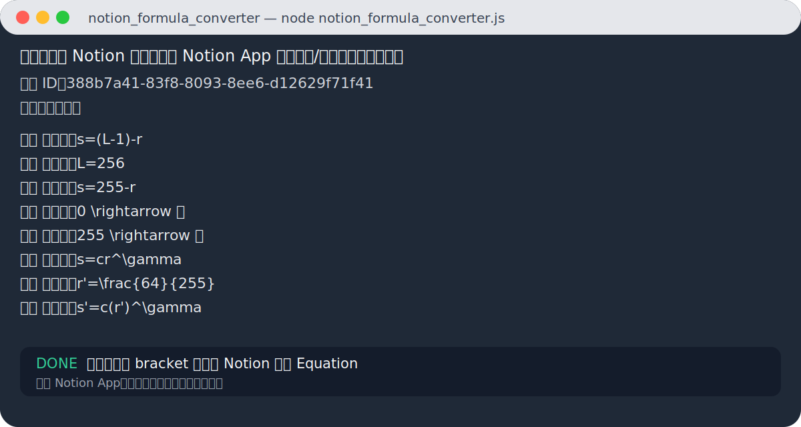
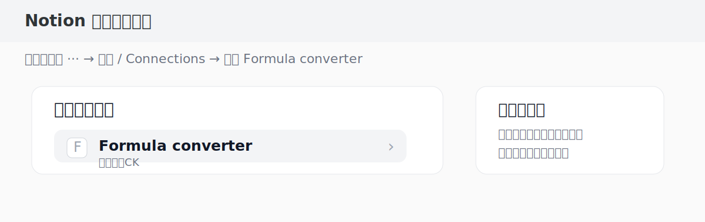
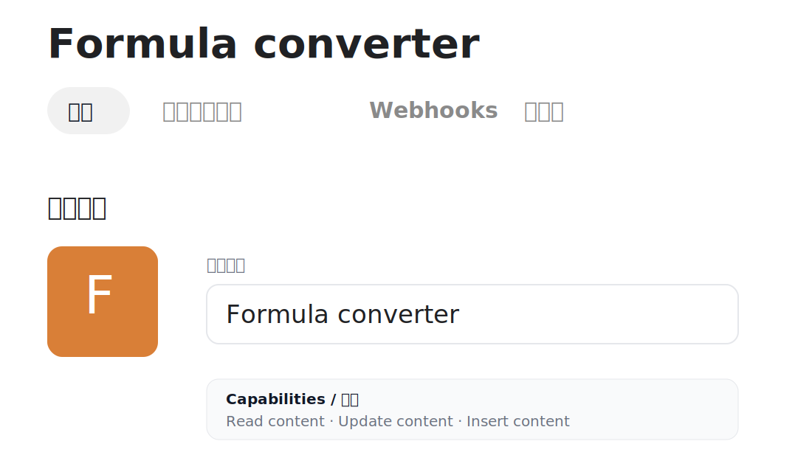

# Notion Formula Converter

## 作用
把 Notion 页面中的公式文本批量转换成 Notion 原生 Equation（块公式/行内公式）。

支持三类常见输入：

```text
[s=(L-1)-r]
```

```text
[
s=(L-1)-r
]
```

```text
T_{out}=
\begin{bmatrix}
5 & 0\\
11 & 0\\
17 & 0
\end{bmatrix}
```

适用于：
- Notion 网页版卡顿
- chatgpt网页端或者app端直接复制粘贴
- claude、gemini等复制版本可能会失效，只需要把复制的公式格式给AI看，改一下代码就行
---

## 展示图

### 运行转换结果



### Notion 页面已连接 Integration



### Integration 配置页面



---

## Notion 开发者入口（官方）
👉 https://www.notion.so/my-integrations

---

## 使用步骤

### 1. 创建 Integration
进入：
https://www.notion.so/my-integrations

点击：
```text
+ New integration
```

权限勾选：
- Read content
- Update content
- Insert content

复制 Token（ntn_xxx）

---

### 2. 授权页面
在 Notion App 打开你的页面：
- 点击右上角 `...`
- Connections / 连接
- 添加你的 integration

---

### 3. 安装 Node.js
确认版本：
```bash
node -v
```
需要 Node.js 18 或以上

---

## 推荐使用方式

### 先预览，不修改页面

```bash
NOTION_TOKEN="你的token" node notion_formula_converter.js "页面URL" --aggressive
```

### 确认数量没问题后正式执行

```bash
NOTION_TOKEN="你的token" node notion_formula_converter.js "页面URL" --aggressive --apply
```

`--aggressive` 等于同时开启：
- `--smart-math`：识别没有 `[ ]` 包裹的明显 LaTeX / 矩阵 / 等式块
- `--cleanup-brackets`：清理残留的孤立 `[` 或 `]`

---

## 稳妥模式
如果你只想转换明确被 `[ ]` 包住的公式，用：

```bash
NOTION_TOKEN="你的token" node notion_formula_converter.js "页面URL" --apply
```

这个模式更保守，但不会处理没有 `[ ]` 的公式。

---

## 参数说明

```text
--apply              正式修改 Notion 页面；不加时只预览
--dry-run            只预览，不修改页面
--smart-math         识别没有 [ ] 包裹的明显 LaTeX/矩阵/等式块
--cleanup-brackets   清理孤立的 [ 和 ] 段落
--aggressive         等于 --smart-math --cleanup-brackets
--no-inline          不转换段落内的 [公式] 行内公式
--no-block           不转换独立的 [ 公式 ] 块公式
--no-recursive       不递归处理子块
--max-group-blocks N 最多把 N 个连续块视作一个 [ ... ] 公式组，默认 80
```

---

## URL 支持
支持：
- https://app.notion.com/p/xxx
- https://www.notion.so/xxx-xxxxxxxx

---

## 安全提醒（非常重要）
⚠️ 不要把 token 发到聊天 / GitHub / 公共仓库

如果泄露：
👉 去 https://www.notion.so/my-integrations 重新生成

---

## 特性
- 自动识别 `[formula]`
- 支持 `[\n formula \n]` 三行结构
- 支持连续 block `[ + 多行公式 + ]`
- 支持没有 `[ ]` 的明显 LaTeX/矩阵/等式块
- 自动清理残留的孤立 `[` 和 `]`
- 自动过滤中文标题类方括号，尽量避免把 `[考试重点]` 误转换

---

## 推荐流程
1. 复制一份 Notion 页面当备份
2. 先运行 `--aggressive` 预览
3. 检查终端里识别出的数量和内容
4. 再运行 `--aggressive --apply`
5. 回到 Notion App 等待同步或刷新
